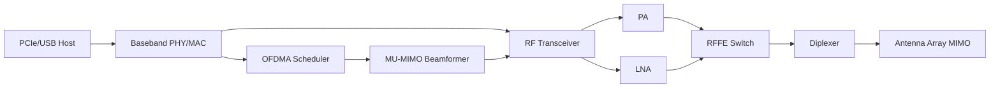

### 1. Engineering Challenges

Enterprise networks face capacity bottlenecks as concurrent client density exceeds 50 devices per AP. WiFi 5 CSMA/CA introduces latency spikes exceeding 30ms under load, while 256-QAM limits peak PHY rate to 1.7Gbps on 80MHz channels.

### 2. Hardware Architecture and Signal/RF Topology

The topology illustrates the signal flow from baseband processing through RF front-end stages to the antenna interface. Each block represents a critical impedance-matched stage in the RF chain, with PA and LNA paths optimized for minimal insertion loss and maximum linearity.

### 3. Core Technical Design and Parameter Optimization

- **Point 1**: **OFDMA Resource Unit**: 26/52/106/242/484/996-tone RU allocations enable simultaneous transmission to 9 clients per 20MHz channel.

- **Point 2**: **RF Front-End Linearity**: PA maintains +22dBm with EVM below -35dB for 1024-QAM. LNA noise figure below 2.5dB across 5-7GHz band.

- **Point 3**: **MU-MIMO Beamforming**: Explicit beamforming with 4x4 array requires calibration matrices updated every 100ms.

- **Point 4**: **Power Management**: Dynamic power save transitions between active (12W), sleep (50mW), and deep sleep (5mW).

- **Point 5**: **Regulatory Compliance**: 6GHz requires AFC for standard-power mode. LPI limits EIRP to 27dBm. DFS required for channels 52-144.

### 4. Industrial Deployment and Performance

Lab characterization (anechoic chamber, 25C, LOS) validates PHY performance. UDP throughput at MCS9 with 80MHz yields 780Mbps average with packet loss below 0.01%. Temperature cycling -40C to +85C shows RX sensitivity degradation within 2dB. Conducted spurious below -45dBm/MHz, compliant with global standards.
