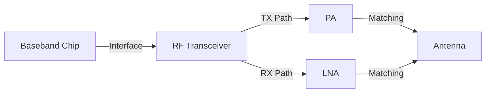

### 1. Engineering Challenges

Industrial wireless connectivity demands robust RF link design capable of maintaining throughput under adverse propagation conditions. Engineering challenges include multi-path fading in reflective environments, co-channel interference, and power budget constraints limiting PA linearity.

### 2. Hardware Architecture and Signal/RF Topology

The topology illustrates the signal flow from baseband processing through RF front-end stages to the antenna interface. Each block represents a critical impedance-matched stage in the RF chain, with PA and LNA paths optimized for minimal insertion loss and maximum linearity.

### 3. Core Technical Design and Parameter Optimization

- **Point 1**: **RF Link Budget**: P_RX = P_TX + G_TX - L_TX - L_path + G_RX - L_RX. Target SNR determines fade margin requirement.

- **Point 2**: **Interface Selection**: PCIe 2.0/3.0 at 5GTps per lane with DMA. USB 3.0 at 5Gbps with simpler integration but higher latency.

- **Point 3**: **Thermal Management**: PA >2.5W requires thermal via arrays >25 vias/cm2. 2oz copper on outer layers improves spreading.

- **Point 4**: **Antenna Diversity**: Separation >lambda/2 provides 10-15dB diversity gain in multipath environments.

- **Point 5**: **Certification**: FCC 15.247/15.407, ETSI EN 301 893 require spurious emission below -41dBm/MHz.

### 4. Industrial Deployment and Performance

Enterprise deployment with 40 concurrent clients per AP shows sustained throughput of 250Mbps per client with MU-MIMO optimization. Latency averages 3ms with jitter below 1ms. Beamforming provides 6dB SNR improvement at cell edge. AP power consumption at 8.5W under full load.
