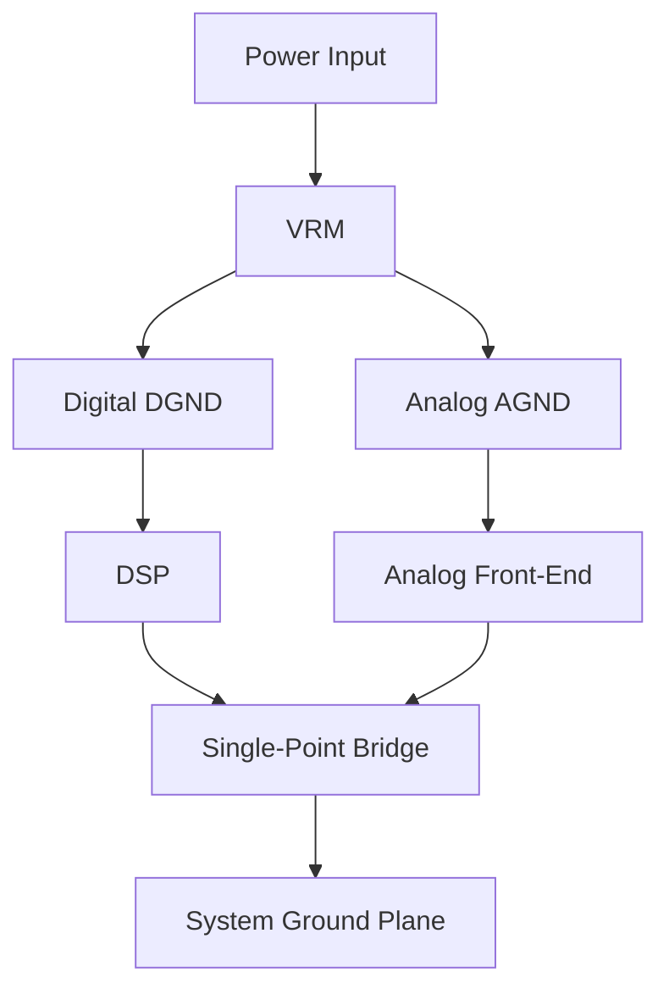

### 1. Engineering Challenges

In high-density multilayer PCBA design, ground plane integrity directly determines signal integrity and EMC compliance. Designers face challenges including digital switching noise coupling into analog domains, high-current ground bounce on power returns, and return path discontinuity for high-speed signals crossing split planes.

### 2. Hardware Architecture and Signal/RF Topology

The topology illustrates the signal flow from baseband processing through RF front-end stages to the antenna interface. Each block represents a critical impedance-matched stage in the RF chain, with PA and LNA paths optimized for minimal insertion loss and maximum linearity.

### 3. Core Technical Design and Parameter Optimization

- **Point 1**: **DC-DC Converter Topology**: Buck converter with 12V input, 5V/1.5A output for PA stage. Switching frequency at 1MHz enables small inductor (2.2uH) and capacitor (22uF) footprint. Efficiency above 90% at full load.

- **Point 2**: **Power Supply Rejection Ratio**: PSRR above 50dB at 100kHz required to prevent switching ripple coupling into RF front-end. Low-dropout regulator (LDO) post-regulation provides 30dB additional rejection at 1MHz.

- **Point 3**: **Decoupling Network**: Multi-stage decoupling with 10uF (bulk) + 100nF (mid-frequency) + 10pF (high-frequency) at each power pin. Total ESL below 1nH using 0402 packages. Power plane impedance below 0.1 ohm from DC to 1GHz.

- **Point 4**: **Thermal Dissipation**: PA stage dissipating 3.5W requires thermal via array with 0.3mm diameter, 0.6mm pitch, 25+ vias. 2oz copper on outer layers and 1oz on inner layers for heat spreading. Junction temperature kept below 105C at 85C ambient.

- **Point 5**: **Power Sequencing**: Core voltage (1.8V) must ramp before I/O voltage (3.3V) with 100us delay. PA supply (5V) enabled after baseband initialization. Sequence timing controlled by power-good signals with 50ms margin.

### 4. Industrial Deployment and Performance

Lab characterization (anechoic chamber, 25C, LOS) validates PHY performance. UDP throughput at MCS9 with 80MHz yields 780Mbps average with packet loss below 0.01%. Temperature cycling -40C to +85C shows RX sensitivity degradation within 2dB. Conducted spurious below -45dBm/MHz, compliant with global standards.
