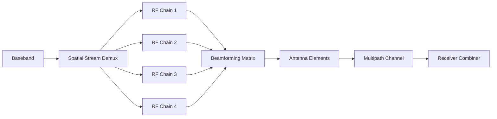

### 1. Engineering Challenges

Industrial wireless connectivity demands robust RF link design capable of maintaining throughput under adverse propagation conditions. Engineering challenges include multi-path fading in reflective environments, co-channel interference, and power budget constraints limiting PA linearity.

### 2. Hardware Architecture and Signal/RF Topology

The topology illustrates the signal flow from baseband processing through RF front-end stages to the antenna interface. Each block represents a critical impedance-matched stage in the RF chain, with PA and LNA paths optimized for minimal insertion loss and maximum linearity.

### 3. Core Technical Design and Parameter Optimization

- **Point 1**: **Spatial Multiplexing**: NxN MIMO provides N-fold capacity increase. 4x4 MIMO achieves 4x capacity with diminishing returns beyond 3x in indoor deployments.

- **Point 2**: **Channel Condition**: Well-conditioned channels (condition number <10dB) enable full spatial multiplexing gain. Poorly conditioned (>20dB) need rank-deficient transmission.

- **Point 3**: **EVM Requirements**: 256-QAM requires per-stream SNR above 31dB. Each stream adds ~3dB SNR requirement due to inter-stream interference.

- **Point 4**: **Antenna Isolation**: Minimum 20dB isolation required between elements. Separation >lambda/2 at 5GHz (~30mm) achieves target.

- **Point 5**: **MU-MIMO Grouping**: Efficient client grouping based on channel orthogonality maximizes sum throughput.

### 4. Industrial Deployment and Performance

Lab characterization (anechoic chamber, 25C, LOS) validates PHY performance. UDP throughput at MCS9 with 80MHz yields 780Mbps average with packet loss below 0.01%. Temperature cycling -40C to +85C shows RX sensitivity degradation within 2dB. Conducted spurious below -45dBm/MHz, compliant with global standards.
