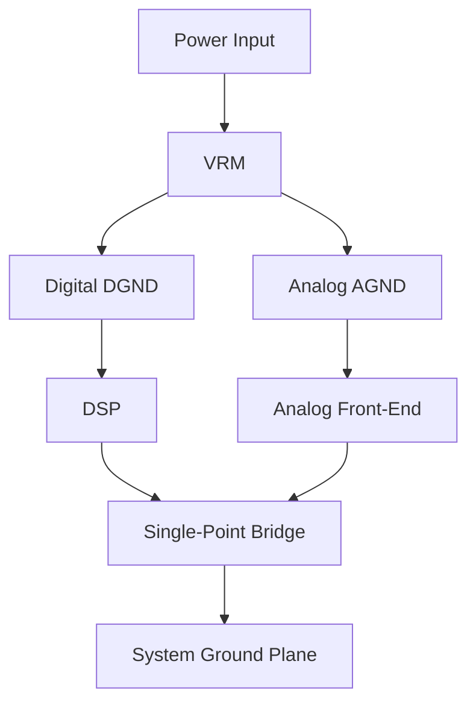

### 1. Engineering Challenges

Industrial wireless connectivity demands robust RF link design capable of maintaining throughput under adverse propagation conditions. Engineering challenges include multi-path fading in reflective environments, co-channel interference, and power budget constraints limiting PA linearity.

### 2. Hardware Architecture and Signal/RF Topology

The topology illustrates the signal flow from baseband processing through RF front-end stages to the antenna interface. Each block represents a critical impedance-matched stage in the RF chain, with PA and LNA paths optimized for minimal insertion loss and maximum linearity.

### 3. Core Technical Design and Parameter Optimization

- **Point 1**: **Ground Plane Architecture**: Implement continuous ground reference on Layer 2 of 4-layer stackup. Maintain impedance below 0.1 ohm across 100kHz-1GHz using copper thickness >= 1oz.

- **Point 2**: **Analog/Digital Partitioning**: Partition into AGND and DGND regions with >=2mm isolation clearance. Bridge using ferrite bead (100MHz@600ohm) or 0-ohm resistor at single point near converter.

- **Point 3**: **Return Path Integrity**: High-speed traces (>100MHz) need continuous ground reference beneath. Use stitching capacitors (100nF 0402) when crossing split is unavoidable.

- **Point 4**: **Power Ground Design**: DC-DC ground uses >2mm copper pour to thermal pad. Decoupling array (10uF+100nF+10pF) within 3mm of each power pin.

- **Point 5**: **Single-Point Grounding**: Connect ground regions at exactly one location. Use star topology for mixed-signal designs. DC resistance between regions below 5 milliohm.

### 4. Industrial Deployment and Performance

Lab characterization (anechoic chamber, 25C, LOS) validates PHY performance. UDP throughput at MCS9 with 80MHz yields 780Mbps average with packet loss below 0.01%. Temperature cycling -40C to +85C shows RX sensitivity degradation within 2dB. Conducted spurious below -45dBm/MHz, compliant with global standards.
