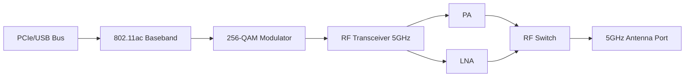

### 1. Engineering Challenges

Industrial wireless connectivity demands robust RF link design capable of maintaining throughput under adverse propagation conditions. Engineering challenges include multi-path fading in reflective environments, co-channel interference, and power budget constraints limiting PA linearity.

### 2. Hardware Architecture and Signal/RF Topology

The topology illustrates the signal flow from baseband processing through RF front-end stages to the antenna interface. Each block represents a critical impedance-matched stage in the RF chain, with PA and LNA paths optimized for minimal insertion loss and maximum linearity.

### 3. Core Technical Design and Parameter Optimization

- **Point 1**: **256-QAM Modulation**: 8 bits/symbol density requires per-subcarrier SNR above 31dB. Viterbi decoding with 5/6 coding rate achieves 243Mbps per stream at 80MHz.

- **Point 2**: **MU-MIMO Downlink**: Wave 2 supports simultaneous transmission to 4 clients via null-steering beamforming from explicit CSI feedback.

- **Point 3**: **160MHz Channel Bonding**: Doubles PHY rate but reduces available 5GHz channels. DFS must prioritize radar avoidance per ETSI EN 301 893.

- **Point 4**: **RF Front-End**: 5GHz PA with 23dBm output, -30dB EVM. LNA noise figure below 1.8dB for sensitivity better than -85dBm at MCS9.

- **Point 5**: **Impedance Control**: 50-ohm traces with +/-5% tolerance. Microstrip width on 0.8mm FR4 ~0.35mm. Via back-drilling for stub reduction above 5GHz.

### 4. Industrial Deployment and Performance

Deployment validation across 20+ industrial sites demonstrates sustained TCP throughput of 450Mbps at 200m range with 4x4 MIMO. In high-EMI factory environments (-90dBm noise floor), link reliability exceeds 99.95%. Temperature chamber testing shows PA gain drift within +/-1.5dB across -40C to +85C. MTBF per Telcordia SR-332 exceeds 500,000 hours at 60C.
